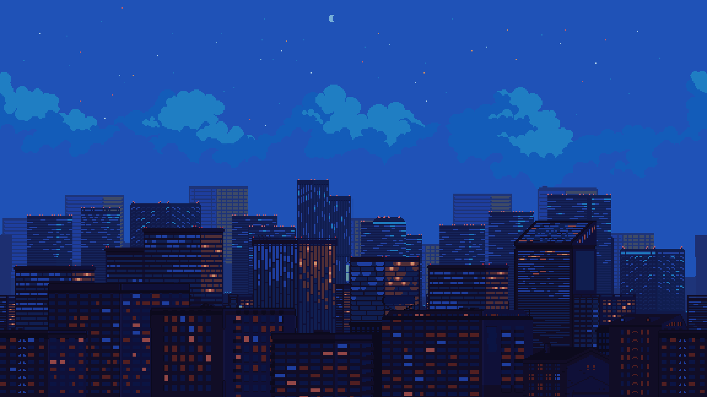
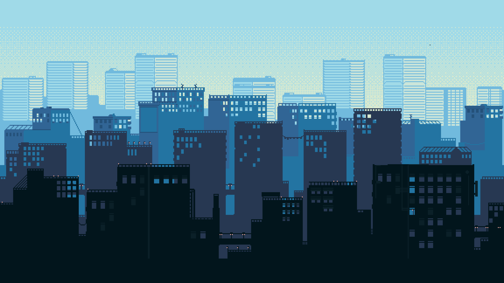
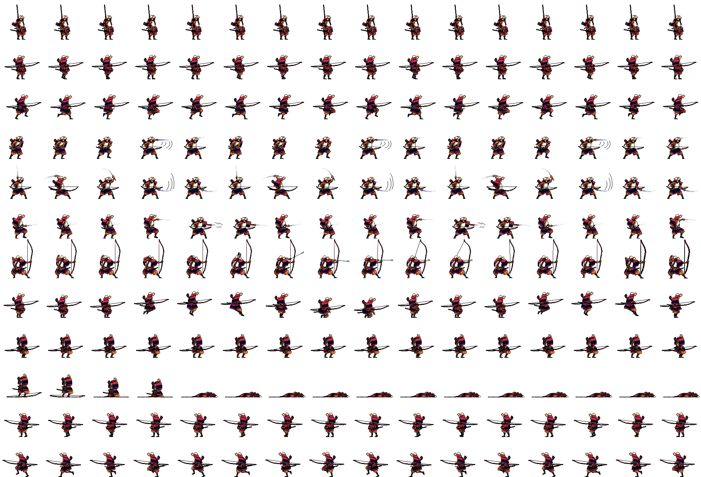
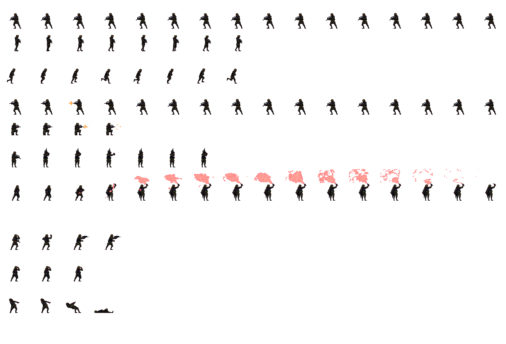
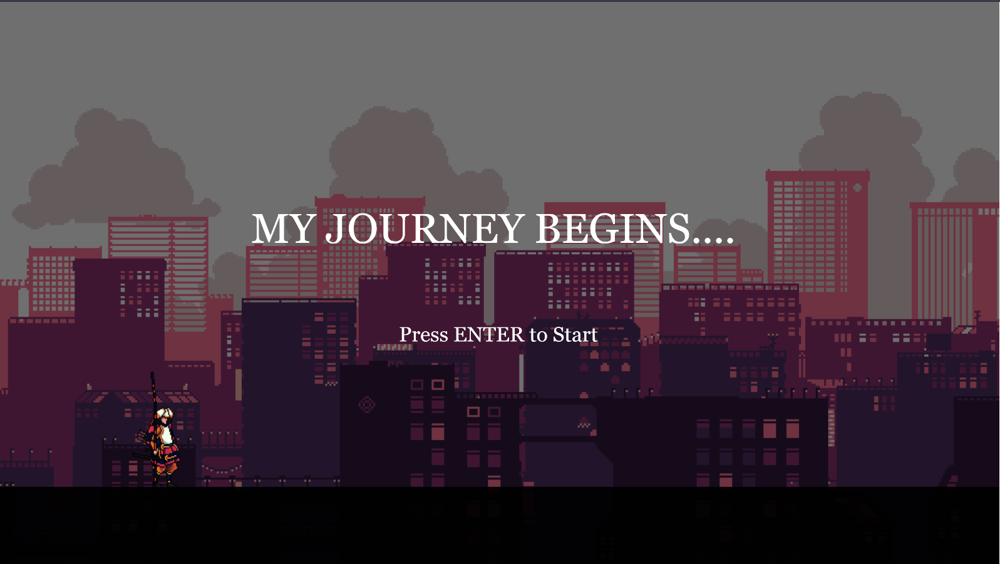
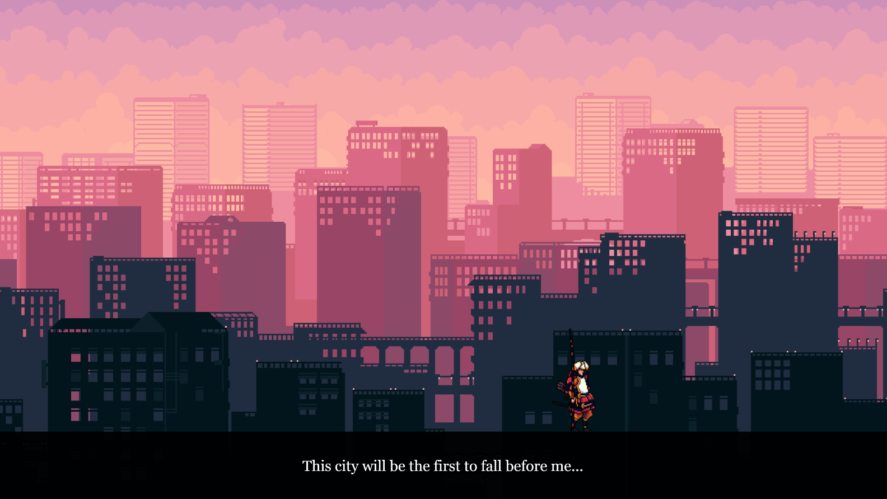
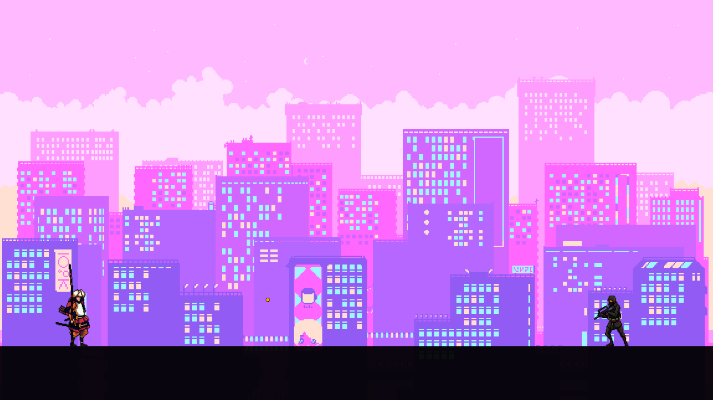
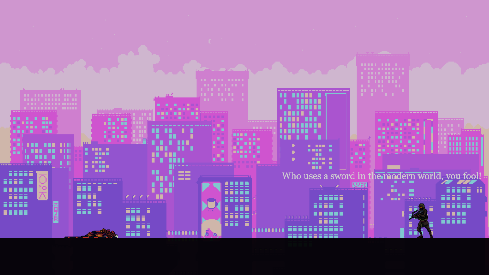
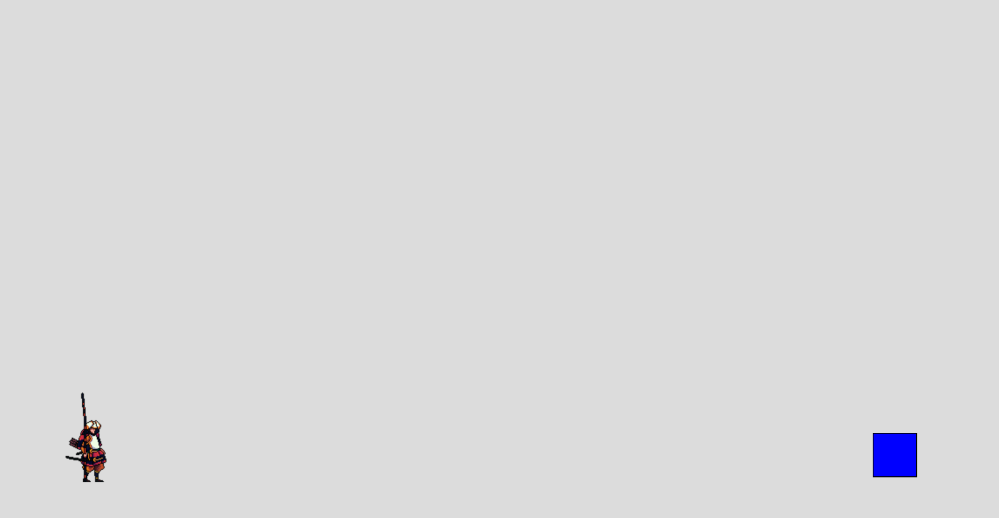

# **Weekend Narrative Project – The Last Samurai**

## Overview
This project is an **interactive narrative** about a **Samurai** on his journey to achieve greatness and conquer the world. The player steps into the Samurai’s role, exploring his story through interaction, dialogue, and movement across multiple narrative frames.
The story unfolds through **playable sequences** where the player moves forward through changing environments, accompanied by powerful dialogues reflecting the Samurai’s ambition and pride. The experience culminates in a dramatic, ironic ending that contrasts the Samurai’s ancient ideals with a modern world that has long moved beyond swords.

## Story
The player takes the role of a **Samurai warrior** whose ultimate goal is to **achieve greatness and conquer the modern world**. As he traverses different landscapes, he delivers self-assured, almost philosophical dialogues about strength, destiny, and power , symbolizing his inner monologue and belief in his superiority.
However, his confidence and ideals face a harsh reality in the final frame.
When he encounters a modern soldier armed with a machine gun, the confrontation lasts only a moment — the Samurai is struck down instantly.

The scene ends with the NPC’s final, mocking dialogue:
“Who uses a sword in the modern world, you fool!”

This ending underlines a contrast between **traditional heroism and modern futility**

## Background Images / Sprite Sheet / Sound

### Visual Assets
* **Background Images (BG1–BG7):** Represent different stages of the Samurai’s journey — from calm villages and battlefields to a futuristic cityscape.

* **Player Sprite Sheet:** Custom Samurai sprite sheet divided into 16 columns × 12 rows for different animation states — idle, walk, sprint, attack, and death.

* **Enemy Sprite Sheet:** Armed soldier sprite sheet with animations for idle and shooting states.

### Sound Assets
* **Background Music (BGM.mp3):** Looping ambient soundtrack from cyberpunk 2077 that establishes the epic tone of the journey.
* **Gunshot (GunShot.mp3):** Plays during the final confrontation.

*(All assets preloaded via p5.js preload() function.)*

## Code and Implementation of the Idea
The project was implemented using`sketch.js`, `player.js`, `enemy.js`, and `bullet.js`. This approach organized gameplay logic, sprite animation, and object behavior effectively.

### Core Implementation Details

#### Scene and State Management
* The narrative is divided into **multiple frames/game states** controlled by `gameState`.
* `0` – Title Screen

* `1–6` – Player journey frames

* `7` – Final scene (NPC confrontation)

* Backgrounds and dialogues update automatically with `gameState`.

#### Sprite Sheet Splitting
let playerSprites = splitSpriteSheet(playerImage, 16, 12);
* Creates a 2D array of frames for animation.
* Handles idle, walk, sprint, attack, and death states.

#### Player Controls and Movement
* **Arrow keys / WASD** for movement.
* **Shift** for sprinting.
* **G key / Mouse click** to attack.
* Player class manages animation row, facing direction, frame delays, and death.

#### Dialogue System
* Dialogue boxes are drawn with:
drawDialogueBox(dialogues[gameState]);
* Displays the Samurai’s internal monologue in sync with game progression.

#### Enemy and Bullet System
* In the final frame (`gameState === 7`):
  * Enemy plays shooting animation.
  * Bullet moves toward player; collision triggers `player.die()`.
  * Background fades and final NPC dialogue appears.

#### Sound and Timing
* Sound effects triggered using `.play()` and `.stop()` in sync with actions.
* Gunshot and background music carefully timed with gameplay events.

## Prototype
* Simplified prototype created for testing frame transitions, collision logic, and sprite movement.
* NPC represented by a blue box; player sprite had basic animations.
* Tested gameState transitions and final dialogue overlay.
* Provided insights for final implementation, especially for movement and interaction timing.

## Challenges

* **Sprite Alignment and Frame Extraction:** Correctly splitting complex sprite sheets required precise calculations and editting of sprite sheet in photoshop.
* **Scene Management:** Ensuring smooth gameState transitions without interrupting animations or music.
* **Death Animation Timing:** Syncing the Samurai’s death with gunshot and fade-to-black effect.
* **Dialogue Synchronization:** Ensuring dialogues matched backgrounds and displayed correctly.

## Outcome
The interactive narrative successfully portrays the **Samurai’s journey** and dramatic downfall.
* Complete 30+ second interactive sequence.
* Integrated animation, audio, and dialogue systems.
* Effective narrative pacing and player interactivity.

### Conclusion

*The Last Samurai* merges **storytelling, gameplay, and animation** to create a cohesive interactive experience. The project demonstrates how timing, dialogue, and movement can convey narrative meaning while engaging the player in interactive storytelling with unexpected ending.
